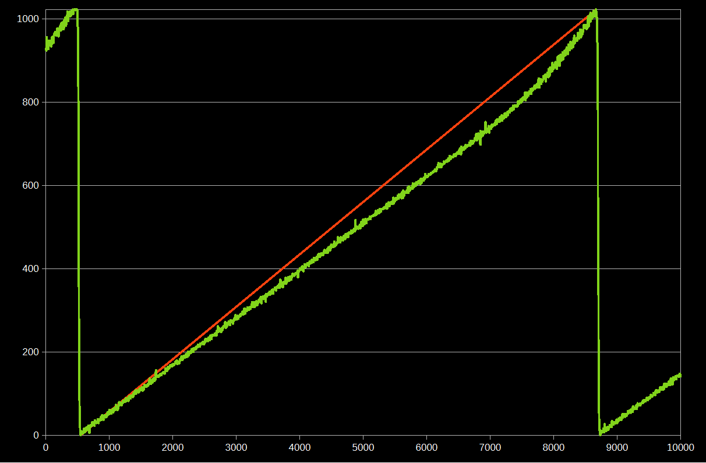
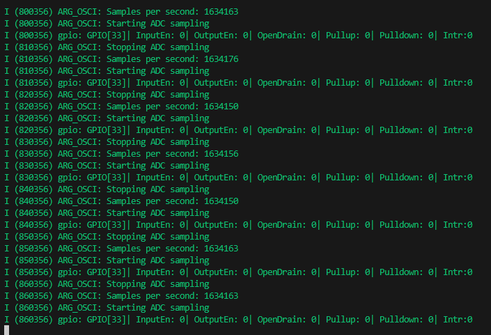
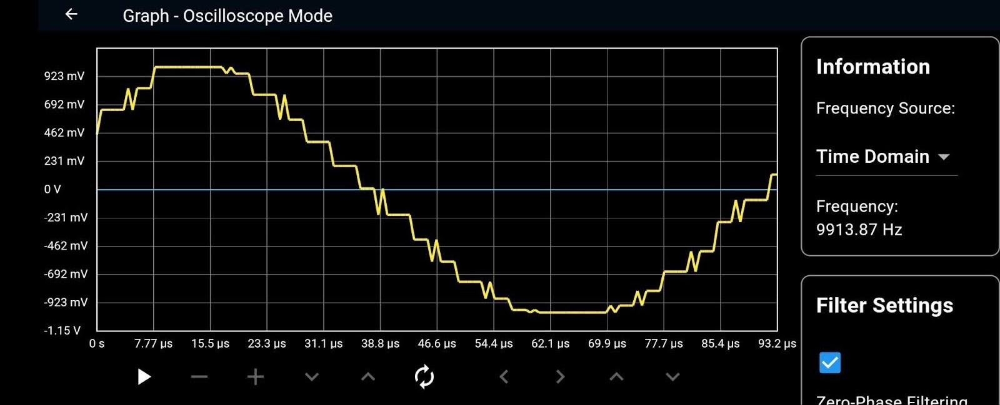
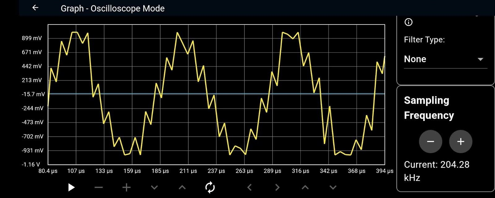
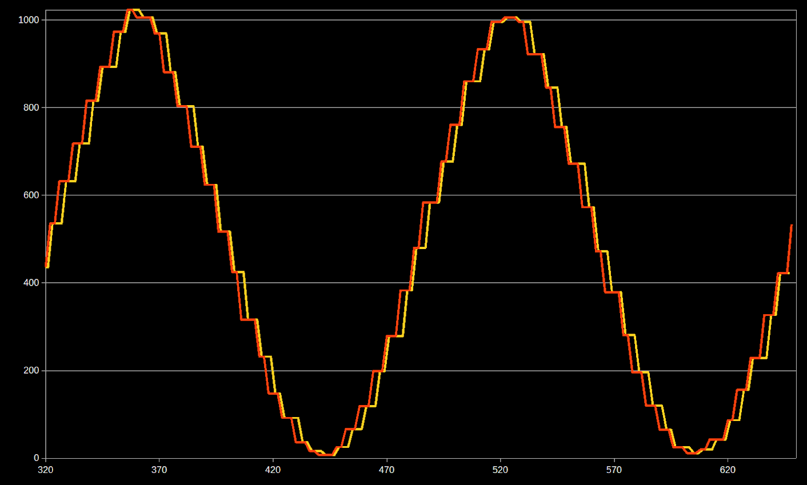
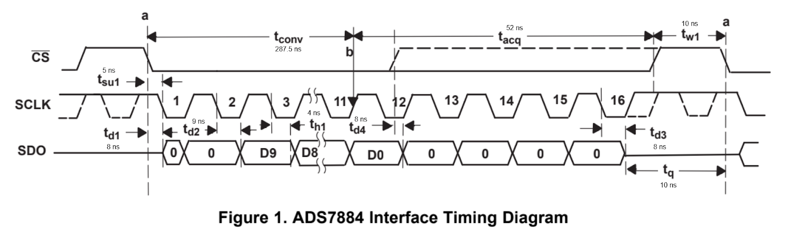

# ARG_OSCI Firmware Implementation Guide

[](https://opensource.org/licenses/MIT)

**ARG_OSCI** is an open-source portable oscilloscope platform. This document details the technical implementation of the firmware, focusing on design decisions, architecture, and improvement opportunities. It is intended for engineers and advanced users interested in understanding, building, or modifying the firmware.

---

## Table of Contents
- [Introduction](#introduction)
- [Design Overview](#design-overview)
- [Device Pinout and Signal Mapping](#device-pinout-and-signal-mapping)
- [Implementation Details](#implementation-details)
  - [1. Acquisition Module](#1-acquisition-module)
    - [1.1 Internal ADC Path](#11-internal-adc-path)
    - [1.2 External ADC Path](#12-external-adc-path)
    - [1.3 Signal Generation and Trigger Logic](#13-signal-generation-and-trigger-logic)
  - [2. Network Module](#2-network-module)
    - [2.1 WiFi Initialization (AP+STA)](#21-wifi-initialization-apsta)
    - [2.2 Socket Management](#22-socket-management)
    - [2.3 Network Utilities](#23-network-utilities)
    - [2.4 WiFi Scanning and Network Management](#24-wifi-scanning-and-network-management)
    - [2.5 Indicators and GPIO](#25-indicators-and-gpio)
    - [2.6 Known Issues and Design Decisions](#26-known-issues-and-design-decisions)
  - [3. Cryptography Module](#3-cryptography-module)
    - [3.1 Technical Overview](#31-technical-overview)
    - [3.2 Example Usage](#32-example-usage)
    - [3.3 Design Notes and Considerations](#33-design-notes-and-considerations)
    - [3.4 Known Issues and Limitations](#34-known-issues-and-limitations)
  - [4. Data Transmission Module](#4-data-transmission-module)
    - [4.1 Technical Overview](#41-technical-overview)
    - [4.2 Example Usage](#42-example-usage)
    - [4.3 Internal vs. External ADC Paths](#43-internal-vs-external-adc-paths)
    - [4.4 Design Decisions and Known Issues](#44-design-decisions-and-known-issues)
    - [4.5 References](#45-references)
  - [5. Webservers Module](#5-webservers-module)
    - [5.1 Architecture and Server Roles](#51-architecture-and-server-roles)
    - [5.2 Main Endpoints and Their Functions](#52-main-endpoints-and-their-functions)
    - [5.3 Example: Setting Trigger Parameters](#53-example-setting-trigger-parameters)
    - [5.4 Example: Connecting to WiFi](#54-example-connecting-to-wifi)
    - [5.5 Secure Communication](#55-secure-communication)
    - [5.6 Design Notes and Known Issues](#56-design-notes-and-known-issues)
    - [5.7 Code Reference](#57-code-reference)
  - [6. Globals and Configuration](#6-globals-and-configuration)
    - [6.1 Centralized Configuration](#61-centralized-configuration)
    - [6.2 ADC Selection](#62-adc-selection)
    - [6.3 Buffer Sizes and Sampling Rate](#63-buffer-sizes-and-sampling-rate)
    - [6.4 GPIO Assignments](#64-gpio-assignments)
    - [6.5 WiFi and Network Configuration](#65-wifi-and-network-configuration)
    - [6.6 Cryptography Parameters](#66-cryptography-parameters)
    - [6.7 Hardware Abstraction and Peripheral Setup](#67-hardware-abstraction-and-peripheral-setup)
    - [6.8 Shared Variables and Synchronization](#68-shared-variables-and-synchronization)
    - [6.9 Design Decisions and Known Issues](#69-design-decisions-and-known-issues)
    - [6.10 Reference](#610-reference)
  - [7. Main Application Flow](#7-main-application-flow)
    - [7.1 Initialization Sequence](#71-initialization-sequence)
    - [7.2 Example: Main Application Flow (Simplified)](#72-example-main-application-flow-simplified)
    - [7.3 Design Notes and Known Issues](#73-design-notes-and-known-issues)
- [Build and Flash Process](#build-and-flash-process)
- [Configuration and Customization](#configuration-and-customization)
- [Extending and Contributing](#extending-and-contributing)
- [Pending Tasks and Recommendations](#pending-tasks-and-recommendations)
- [License](#license)
- [Acknowledgements](#acknowledgements)

---

## Introduction

This document describes the implementation of the ARG_OSCI firmware, including the rationale behind each software block, technical notes, and suggestions for further development. For usage instructions, refer to the user manual. For more precise technical details, see the comments in the source code files.

---

## Design Overview

The firmware is organized into several functional blocks:
- Acquisition (internal/external ADC, SPI, MCPWM, trigger logic)
- Network (WiFi AP/STA, socket management)
- Cryptography (RSA key generation, secure endpoints)
- Data Transmission (buffering, streaming, trigger modes)
- Webservers (HTTP REST API for configuration/control)
- Globals (shared configuration, compile-time options)
- Main (system initialization and orchestration)

> **Note:** See the `diagrams/` folder for block and sequence diagrams. Consider including a simplified architecture diagram here.

## Device Pinout and Signal Mapping

This section summarizes the default pin assignments for all major signals and peripherals used in the ARG_OSCI firmware. Pin definitions are centralized in `globals.h` and can be modified to suit custom hardware.

| Function/Signal                | GPIO (Default) | Macro/Usage             | Mode                |
|------------------------------- |:--------------:|------------------------|---------------------|
| Signal input                   | GPIO33         | SINGLE_INPUT_PIN        | General             |
| Calibration signal (1kHz sq.)  | GPIO32         | SQUARE_WAVE_GPIO        | General             |
| PWM output (trigger level)     | GPIO27         | TRIGGER_PWM_GPIO        | General             |
| Status LED                     | GPIO25         | LED_GPIO                | General             |
| ADC input                      | GPIO34         | ADC_CHANNEL_6           | Internal ADC only   |
| SPI MISO (external ADC data)   | GPIO12         | PIN_NUM_MISO            | External ADC only   |
| SPI SCLK                       | GPIO14         | PIN_NUM_CLK             | External ADC only   |
| SPI CS                         | GPIO15         | PIN_NUM_CS              | External ADC only   |
| MCPWM output (ADC trigger)     | GPIO13         | MCPWM_GPIO              | External ADC only   |
| SYNC signal (trigger sync)     | GPIO2          | SYNC_GPIO               | External ADC only   |

- All pin assignments are defined in `globals.h` for easy modification.
- Ensure that the selected pins do not conflict with other peripherals or reserved ESP32 functions.
- For custom hardware, update the macros in `globals.h` accordingly.

> **Tip:** Refer to this table when wiring the device or porting the firmware to new hardware.

---

## Implementation Details

### 1. Acquisition Module

The Acquisition Module is responsible for sampling analog signals and converting them into digital data for further processing and transmission. It supports two acquisition paths, selectable at compile time: the ESP32’s internal ADC or an external ADC via SPI. The design aims to balance flexibility, performance, and hardware abstraction.

#### 1.1 Internal ADC Path
- **Overview:**
  - Utilizes the ESP32’s built-in ADC in continuous mode, leveraging the ESP-IDF `adc_continuous` driver.
  - Sampling frequency and buffer size are configurable via `globals.h`.
  - Trigger logic is implemented in software, with support for both continuous and single-shot acquisition modes.
- **Technical Notes:**
  - **Nonlinearity:** The ESP32 internal ADC is known for nonlinearity and offset errors, especially at higher bit widths. Calibration is recommended for precision applications.

   

  - **Sampling Rate:** Maximum achievable sampling rate is limited (~600 kHz) due to hardware and DMA constraints. The `SAMPLE_RATE_HZ` macro controls the target rate.
  - **I2S Communication Issues:**
    - Although the I2S peripheral is no longer used directly for ADC sampling, it remains the underlying transport for the ESP32 ADC continuous driver. This introduces several issues:
      - At high sampling rates (e.g., 2 MHz), the actual data rate is significantly lower than configured (e.g., ~1.63 MSa/s, an 18% reduction).

      

      - Data exhibits plateau (repeated values) and phase-shifted spikes due to the stereo nature of I2S and its internal buffering.

      

      - The I2S driver may repeat samples until a new ADC conversion is available, causing visible steps in the acquired signal.
      - At frequencies below ~300 kHz, these effects are minimized, but phase issues persist.

      

      
      - A workaround is to sample at higher rates and discard every other sample, achieving a more accurate effective sampling rate (e.g., 600 kHz nominal, 240 kHz effective).
  - **Single Event Detection:** Single trigger events are detected using a dedicated GPIO input (SINGLE_INPUT_PIN).
  - **Memory Management:** Buffer sizes must be tuned to avoid memory exhaustion, especially when running multiple FreeRTOS tasks.
- **Example Usage:**
  ```c
  // Start continuous ADC sampling
  start_adc_sampling();

  // Stop and deinitialize ADC
  stop_adc_sampling();
  ```
- **Known Issues:**
  - Nonlinearity and limited ENOB (Effective Number of Bits).
  - Occasional initialization failures if memory is fragmented; mitigated by retry logic and delays.
  - ADC readings may be affected by WiFi activity due to shared power rails.
- **Design Decisions:**
  - Chose native ADC driver over I2S for simplicity and reliability.
  - Exposed configuration functions for dynamic adjustment of sampling frequency and buffer size.

#### 1.2 External ADC Path
- **Overview:**
  - Communicates with a high-speed external ADC via SPI, allowing for higher sampling rates and improved linearity.
  - Uses MCPWM (Motor Control PWM) to generate precise trigger signals for the ADC, and the Pulse Counter (PCNT) peripheral for edge detection.
  - SPI protocol and timing parameters are defined in `spi_matrix` for flexible hardware adaptation.
- **Technical Notes:**
  - **SPI Protocol:** Custom protocol with half-duplex transfers, no dummy cycles, and precise chip-select timing. The SPI bus is initialized with `spi_master_init()`.
  - **MCPWM Rationale:** MCPWM is used instead of standard timers to generate highly accurate and synchronized trigger pulses, essential for consistent sampling intervals at high speeds.
  - **Pulse Counter:** PCNT is configured to count trigger edges, enabling robust single-shot and edge-triggered acquisition modes.
  - **Timing Coordination:** The SYNC signal (SYNC_GPIO) must be physically connected to the SPI CS pin (PIN_NUM_CS) to ensure that SPI transactions and MCPWM trigger pulses are perfectly synchronized for the external ADC.
  - **Single Event Detection:** The PCNT peripheral is used exclusively for detecting single trigger events in external ADC mode.


- **Example Usage:**
  ```c
  // Initialize SPI and trigger peripherals
  spi_master_init();
  init_mcpwm_trigger();
  init_pulse_counter();
  ```
- **Known Issues:**
  - Requires careful tuning of MCPWM and SPI timing parameters for reliable operation.
  - External ADC must be electrically compatible with ESP32 voltage levels.
- **Design Decisions:**
  - Chose SPI+MCPWM for maximum flexibility and performance.
  - All timing parameters are abstracted in `spi_matrix` for easy hardware adaptation.

#### 1.3 Signal Generation and Trigger Logic
- **Signal Generation:**
  - The module provides sine and square wave generators for calibration and testing.
  - Sine wave is generated using the ESP32 DAC and `dac_cosine` driver; square wave uses the LEDC PWM peripheral.
  - Example:
    ```c
    init_sine_wave();    // Start sine wave output on DAC
    init_square_wave();  // Start square wave output on GPIO
    ```
- **Trigger Logic:**
  - Trigger level is controlled via PWM output (LEDC) to a reference voltage circuit.
  - Edge selection and trigger arming are managed in software.
  - Example:
    ```c
    set_trigger_level(50); // Set trigger to 50% of range
    ```
- **Sampling Frequency Adjustment:** Both internal and external ADC modules support dynamic modification of the sampling frequency, allowing the user to analyze both fast and slow signals effectively.
- **Design Notes:**
  - All hardware initialization is abstracted into dedicated functions for clarity and maintainability.
  - The acquisition module exposes configuration and status functions for integration with the main application and webserver APIs.

> **See also:**
> - `main/acquisition.c` and `include/acquisition.h` for full API and implementation details.

---

### 2. Network Module

The Network module manages WiFi connectivity and network operations for the firmware, providing a robust foundation for device communication and remote control.

#### 2.1 WiFi Initialization (AP+STA)
- The firmware initializes WiFi in simultaneous Access Point (AP) and Station (STA) mode, allowing the ESP32 to act as its own access point while optionally connecting to an external network.
- Default network interfaces (`WIFI_AP_DEF` and `WIFI_STA_DEF`) are created if they do not exist.
- AP configuration (SSID, password, authentication mode, max connections) is defined via macros in `globals.h`.
- If the password is empty, the AP is set to open mode (`WIFI_AUTH_OPEN`).

**Initialization example:**
```c
wifi_init();
```

#### 2.2 Socket Management
- Functions are provided to create, bind, and listen on TCP sockets, as well as to safely close them.
- The `safe_close` function attempts a graceful shutdown with a timeout (SO_LINGER), and forces immediate closure if that fails.
- This robust mechanism prevents resource leaks and reconnection issues.

**Safe close example:**
```c
safe_close(sock);
```

#### 2.3 Network Utilities
- AP IP retrieval: `get_ap_ip_info` fetches the IP, gateway, and netmask for the AP interface.
- STA IP wait: `wait_for_ip` polls until an IP is assigned when connecting to an external network (timeout after 10 attempts).
- Socket creation and binding: `create_socket_and_bind` creates a TCP socket, binds it to the local IP, and starts listening.

**IP retrieval example:**
```c
esp_netif_ip_info_t ip_info;
get_ap_ip_info(&ip_info);
```

#### 2.4 WiFi Scanning and Network Management
- The module can scan for nearby WiFi networks and return a list of unique SSIDs in JSON format (`scan_and_get_ap_records`).
- The helper function `add_unique_ssid` ensures no duplicate SSIDs are added to the list.
- Scanning is useful for configuration via the web interface.

**Scan example:**
```c
uint16_t num_networks;
cJSON *networks = scan_and_get_ap_records(&num_networks);
```

#### 2.5 Indicators and GPIO
- A GPIO is configured as output to indicate network status or socket creation (`configure_led_gpio`).

#### 2.6 Known Issues and Design Decisions
- AP+STA mode offers maximum flexibility but may impact WiFi stability in some environments (ESP32 limitation).
- Safe socket closure is critical to avoid lockups after abrupt disconnections.
- WiFi scanning can consume memory; scan results are freed after use.
- All critical configuration (SSID, password, pins) is centralized in `globals.h` for portability.

> **See also:**
> - `main/network.c` and `include/network.h` for implementation details and API.

---

### 3. Cryptography Module

The Cryptography Module implements secure communication and configuration for the device using RSA public-key cryptography. It is responsible for generating, storing, and managing a 3072-bit RSA key pair at startup, and for providing decryption services for encrypted commands received from clients (such as the web interface).

#### 3.1 Technical Overview
- **Key Generation:**
  - The device generates a 3072-bit RSA key pair at startup using mbedTLS. This is performed in a dedicated FreeRTOS task (`generate_key_pair_task`) to avoid blocking the main application.
  - The key generation process uses the mbedTLS entropy and CTR-DRBG modules for secure random number generation, and stores the resulting keys in PEM format in global buffers.
  - A binary semaphore is used to signal completion of key generation, ensuring that the main application waits until keys are available before proceeding.

- **Key Storage and Access:**
  - The public and private keys are stored in global buffers (`public_key`, `private_key`), accessible via accessor functions.
  - The key size is defined as a macro (`KEYSIZE`) for consistency and easy modification.

- **Decryption and Secure Communication:**
  - The module provides functions to decrypt data using the device's private key (`decrypt_with_private_key`) and to handle Base64-encoded encrypted messages (`decrypt_base64_message`).
  - These functions are used to securely receive and process sensitive configuration data (e.g., WiFi credentials) from the web interface.

- **mbedTLS Integration:**
  - All cryptographic operations use mbedTLS, including the PK (public key), entropy, CTR-DRBG, and Base64 modules.
  - Contexts are initialized and freed for each operation to ensure resource safety.

#### 3.2 Example Usage

**Initialization and Key Generation (main.c):**
```c
// Initialize cryptography and start key generation task
ESP_ERROR_CHECK(init_crypto());
xTaskCreate(generate_key_pair_task, "generate_key_pair_task", 8192, NULL, 5, NULL);

// Wait for key generation to complete before proceeding
if (xSemaphoreTake(get_key_gen_semaphore(), portMAX_DELAY) != pdTRUE) {
    ESP_LOGE(TAG, "Failed to wait for key generation");
    return;
}
ESP_LOGI(TAG, "RSA key pair generated successfully");
```

**Decrypting a Base64-encoded Message:**
```c
char decrypted[256];
if (decrypt_base64_message(encrypted_base64, decrypted, sizeof(decrypted)) == ESP_OK) {
    // Use decrypted data
}
```

**Accessing the Public Key for Transmission:**
```c
unsigned char *pubkey = get_public_key();
// Send pubkey to client for encryption
```

#### 3.3 Design Notes and Considerations
- **Security:** Uses 3072-bit RSA keys for strong security. The key size can be adjusted as needed.
- **Resource Management:** All mbedTLS contexts are properly freed after use. Key generation is offloaded to a task to avoid blocking.
- **Synchronization:** A binary semaphore ensures that the main application does not proceed until keys are ready.
- **API Simplicity:** The module exposes simple functions for initialization, key access, and decryption, hiding cryptographic complexity from the rest of the application.
- **Error Handling:** All operations include robust error checking and logging for troubleshooting.

#### 3.4 Known Issues and Limitations
- **Key Generation Time:** Generating a 3072-bit RSA key on the ESP32 can take several minutes, especially on first boot.
- **Memory Usage:** Large key buffers and cryptographic contexts require sufficient heap space. Stack size for the key generation task should be set appropriately (see main.c).
- **No Persistent Storage:** Keys are generated at every boot; persistent storage is not implemented by default.

> **See also:**
> - `main/crypto.c` and `include/crypto.h` for full implementation details and API documentation.
> - mbedTLS documentation for further information on cryptographic primitives used.

---

### 4. Data Transmission Module

The Data Transmission module is responsible for streaming acquired data samples to clients over TCP sockets. It manages buffer acquisition, trigger logic, and efficient data transfer, supporting both continuous and single-trigger acquisition modes. The implementation adapts to the selected acquisition path (internal or external ADC) and includes robust mechanisms for socket management and error handling.

#### 4.1 Technical Overview
- **Buffer Management:** Data is acquired from the ADC (internal or external) into a buffer, which is then sent to the client in packets. Buffer size and sample size are configurable.
- **Acquisition Modes:**
  - **Continuous Mode:** Data is streamed continuously as it is acquired.
  - **Single Trigger Mode:** Data is sent only when a trigger event (edge) is detected on the input signal.
- **Non-blocking TCP Send:** The module uses non-blocking send operations (`non_blocking_send`) to avoid blocking the main task, improving responsiveness and allowing for interruption (e.g., WiFi operations or socket resets).
- **Socket Management:**
  - Handles client connections, disconnections, and socket resets (especially important in external ADC mode).
  - Provides mechanisms to safely close sockets and recover from errors or network changes.
- **Synchronization:** Uses atomic variables and FreeRTOS synchronization primitives to coordinate between tasks and handle asynchronous events (e.g., WiFi changes, socket resets).

#### 4.2 Example Usage

**Switching Acquisition Modes:**
```c
// Set single trigger mode (waits for a trigger event)
set_single_trigger_mode();

// Set continuous streaming mode
set_continuous_mode();
```

**Acquiring and Sending Data:**
```c
uint8_t buffer[BUF_SIZE];
uint32_t bytes_read = 0;
if (acquire_data(buffer, BUF_SIZE, &bytes_read) == ESP_OK && bytes_read > 0) {
    non_blocking_send(client_sock, buffer, bytes_read, 0);
}
```

**Socket Task Loop (simplified):**
```c
void socket_task(void *pvParameters) {
    while (1) {
        // Accept client connection
        // Acquire data (from ADC or SPI)
        // Send data to client using non_blocking_send
        // Handle trigger logic and mode switching
        // Manage socket resets and WiFi operations
    }
}
```

#### 4.3 Internal vs. External ADC Paths
- **Internal ADC:**
  - Uses `adc_continuous_read` to acquire data.
  - Handles WiFi operation requests by pausing ADC sampling and resuming after network changes.
  - Trigger detection is performed via GPIO input.
- **External ADC:**
  - Uses SPI transactions to acquire data from the external ADC.
  - Employs MCPWM and PCNT peripherals for precise trigger and edge detection.
  - Includes explicit socket reset logic to handle client disconnections and ensure clean state transitions.

#### 4.4 Design Decisions and Known Issues
- **Non-blocking Send:** Chosen to prevent the task from blocking on slow or unreliable network connections. This allows the system to remain responsive to control events (e.g., WiFi changes, socket resets).
- **Socket Reset Mechanism:** In external ADC mode, a dedicated flag (`socket_reset_requested`) and functions (`request_socket_reset`, `force_socket_cleanup`) ensure that sockets are closed cleanly and resources are released, even if the main task is busy.
- **Error Handling:** The module logs and counts missed ADC/SPI readings. If repeated errors occur, it attempts to recover or signals a critical error.
- **Synchronization:** Atomic variables and semaphores are used to coordinate between tasks and handle asynchronous events safely.
- **Resource Management:** Sockets are always closed safely using `safe_close` to prevent resource leaks.

#### 4.5 References
- See `main/data_transmission.c` and `include/data_transmission.h` for full implementation details and API documentation.
- The module is tightly integrated with the Acquisition and Network modules for data flow and socket management.

---

### 5. Webservers Module

The Webservers module implements two HTTP servers on the ESP32, providing RESTful endpoints for device configuration, control, and secure communication. This module is central to the user interface, allowing remote management of acquisition parameters, WiFi settings, and trigger modes via HTTP requests from a web client or application.

#### 5.1 Architecture and Server Roles
- **Primary server (port 81):** Active when the ESP32 is in Access Point (AP) mode. Handles configuration and control when the user connects directly to the device's WiFi.
- **Secondary server (port 80):** Activated when the ESP32 connects to an external WiFi network (Station mode). Allows configuration and control over the local network.
- Both servers register similar sets of URI handlers for REST endpoints, with some differences in available routes.

#### 5.2 Main Endpoints and Their Functions
- `/config` (GET): Returns a JSON object with current device configuration (sampling frequency, bit depth, buffer sizes, voltage scales, etc.).
- `/scan_wifi` (GET): Scans for available WiFi networks and returns a JSON array of SSIDs.
- `/connect_wifi` (POST): Receives encrypted WiFi credentials, decrypts them using the device's private key, and attempts to connect to the specified network. Responds with connection status and assigned IP/port.
- `/reset` (GET): Resets the data socket, creating a new socket for data streaming. Ensures clean state after network changes or client disconnects.
- `/trigger` (POST): Sets trigger parameters (edge type and voltage level) for signal acquisition. Accepts JSON specifying `trigger_edge` ("positive"/"negative") and `trigger_percentage`.
- `/single` (GET): Switches the device to single-shot acquisition mode.
- `/normal` (GET): Switches the device to continuous acquisition mode.
- `/freq` (POST): Adjusts the sampling frequency (ADC or SPI) based on the requested action ("more"/"less").
- `/get_public_key` (GET): Returns the device's RSA public key in PEM format for secure communication. Includes CORS headers for cross-origin requests.
- `/test` (POST, secondary server only): Receives an encrypted message, decrypts it, and returns the plaintext. Used to verify secure communication.
- `/testConnect` (GET): Simple endpoint returning "1" to verify server is alive.
- `/internal_mode` (GET): Switches the device back to AP mode and reconfigures the data socket accordingly.

#### 5.3 Example: Setting Trigger Parameters
```json
POST /trigger
{
  "trigger_edge": "positive",
  "trigger_percentage": 50
}
```
Response:
```json
{
  "set_percentage": 50,
  "edge": "positive"
}
```

#### 5.4 Example: Connecting to WiFi
```json
POST /connect_wifi
{
  "SSID": "<base64-encrypted-ssid>",
  "Password": "<base64-encrypted-password>"
}
```
Response:
```json
{
  "IP": "192.168.1.100",
  "Port": 12345,
  "Success": "true"
}
```

#### 5.5 Secure Communication
- All sensitive data (e.g., WiFi credentials) must be encrypted with the device's public key before transmission.
- The `/get_public_key` endpoint provides the public key to clients.
- The `/test` endpoint can be used to verify that encryption/decryption is working as expected.

#### 5.6 Design Notes and Known Issues
- **Separation of AP and STA servers** ensures that configuration is always possible, even if the device is not connected to an external network.
- **Socket management** is tightly integrated: endpoints like `/reset` and `/connect_wifi` ensure that data sockets are safely closed and recreated as needed, preventing resource leaks or stale connections.
- **Synchronization with acquisition tasks**: When changing network state or sockets, the webserver coordinates with acquisition/data transmission tasks to avoid race conditions (e.g., pausing ADC or SPI operations before network changes).
- **CORS support** is explicitly set for endpoints returning the public key, enabling web applications to interact securely with the device.
- **Error handling**: All endpoints return appropriate HTTP status codes and JSON error messages on failure.
- **Known limitations**: The number of simultaneous connections is limited by the ESP-IDF HTTP server. Some endpoints (e.g., `/test`) are only available on the secondary server.

#### 5.7 Code Reference
The implementation of the webservers and their handlers can be found in:
- `main/webservers.c` — All endpoint handlers and server startup logic.
- `include/webservers.h` — API documentation and function prototypes.

Example: Registering endpoints in `start_webserver()`:
```c
httpd_uri_t config_uri = {.uri = "/config", .method = HTTP_GET, .handler = config_handler, .user_ctx = NULL};
httpd_register_uri_handler(server, &config_uri);
// ... other handlers ...
```

For detailed handler logic, see the corresponding functions in `webservers.c` (e.g., `config_handler`, `connect_wifi_handler`, `trigger_handler`).

---

### 6. Globals and Configuration

The `globals.h` file centralizes all key configuration options, hardware abstraction macros, and shared variables for the firmware. This approach ensures that hardware adaptation, feature toggling, and system-wide parameters can be managed from a single location, improving maintainability and portability.

#### 6.1 Centralized Configuration
- All major compile-time options, such as ADC selection, buffer sizes, GPIO assignments, WiFi credentials, and cryptography parameters, are defined as macros in `globals.h`.
- Shared variables and synchronization primitives (e.g., atomic flags, semaphores, FreeRTOS handles) are declared as `extern` for cross-module access.

#### 6.2 ADC Selection
- The firmware supports both internal and external ADC acquisition paths, selectable at compile time:
  ```c
  #define USE_EXTERNAL_ADC // Use external ADC via SPI
  // Comment out to use internal ESP32 ADC
  ```
- This macro controls conditional compilation throughout the codebase, enabling or disabling relevant code blocks for each acquisition mode.

#### 6.3 Buffer Sizes and Sampling Rate
- Buffer sizes and sampling rates are defined as macros, allowing easy tuning for performance or memory constraints:
  ```c
  #define BUF_SIZE 17280 * 4 // For external ADC
  // or
  #define BUF_SIZE 1440 * 30 // For internal ADC
  #define SAMPLE_RATE_HZ 600000 // 600 kHz
  ```
- Adjust these values to balance throughput, latency, and available RAM. Large buffers improve streaming performance but may cause memory exhaustion if set too high.

#### 6.4 GPIO Assignments
- All pin assignments are defined as macros for clarity and hardware portability:
  ```c
  #define SINGLE_INPUT_PIN GPIO_NUM_33
  #define SQUARE_WAVE_GPIO GPIO_NUM_32
  #define TRIGGER_PWM_GPIO GPIO_NUM_27
  #define LED_GPIO GPIO_NUM_25
  // ...
  ```
- Update these macros to match your custom hardware. Ensure that selected pins do not conflict with reserved ESP32 functions or other peripherals.

#### 6.5 WiFi and Network Configuration
- Default SSID, password, and network parameters are set via macros:
  ```c
  #define WIFI_SSID "ESP32_AP"
  #define WIFI_PASSWORD "password123"
  #define MAX_STA_CONN 4
  #define PORT 8080
  ```
- These can be changed to set up the device as an access point or to connect to a specific network.

#### 6.6 Cryptography Parameters
- RSA key size and buffer lengths are defined for the cryptography module:
  ```c
  #define KEYSIZE 3072
  #define KEYSIZEBITS 3072 * 8
  ```
- These macros ensure consistent key management across the firmware.

#### 6.7 Hardware Abstraction and Peripheral Setup
- Macros are used to abstract timer, SPI, PWM, and pulse counter configuration, making it easier to port the firmware to different hardware or adjust timing parameters.
- Example: SPI matrix for external ADC timing is defined as a 2D macro array for flexible adaptation.

#### 6.8 Shared Variables and Synchronization
- All global variables that need to be accessed across modules (e.g., handles, atomic flags, semaphores) are declared as `extern` in `globals.h` and defined in their respective source files.
- Example:
  ```c
  extern atomic_int adc_modify_freq;
  extern spi_device_handle_t spi;
  extern SemaphoreHandle_t key_gen_semaphore;
  // ...
  ```
- This pattern ensures safe and consistent access to shared state.

#### 6.9 Design Decisions and Known Issues
- **Compile-time configuration** via macros is preferred for performance and code clarity, but requires recompilation for changes.
- **Pin conflicts**: Care must be taken to avoid assigning the same GPIO to multiple functions.
- **Memory usage**: Large buffer sizes or key buffers may exhaust available RAM, especially when running multiple FreeRTOS tasks.
- **Conditional compilation**: The use of `#ifdef USE_EXTERNAL_ADC` ensures that only relevant code and variables are included for the selected acquisition path, reducing binary size and potential errors.

#### 6.10 Reference
- All configuration options and shared variables are documented in [`include/globals.h`](include/globals.h). Review and update this file when porting the firmware or adding new features.

> **Tip:** Always review `globals.h` before making hardware changes or tuning performance parameters. For runtime configuration, consider extending the webserver API to allow dynamic updates of certain parameters.

---

### 7. Main Application Flow

The main application flow orchestrates the initialization and coordination of all firmware modules, ensuring that hardware, network, cryptography, and data streaming subsystems are properly set up before entering normal operation. The entry point is the `app_main()` function in `main.c`.

#### 7.1 Initialization Sequence

The startup sequence is as follows:

1. **NVS Initialization:**
   - Initializes Non-Volatile Storage (NVS) for configuration persistence.
   - Handles cases where NVS needs to be erased and re-initialized.
   - Example:
     ```c
     esp_err_t ret = nvs_flash_init();
     if (ret == ESP_ERR_NVS_NO_FREE_PAGES || ret == ESP_ERR_NVS_NEW_VERSION_FOUND) {
         ESP_ERROR_CHECK(nvs_flash_erase());
         ret = nvs_flash_init();
     }
     ESP_ERROR_CHECK(ret);
     ```

2. **Network Stack and Event Loop:**
   - Initializes the ESP-IDF network interface and event loop.
   - Ensures the system is ready for WiFi and socket operations.

3. **Watchdog Timer:**
   - Deinitializes any previous task watchdog configuration to avoid conflicts.

4. **Cryptography and RSA Key Generation:**
   - Initializes the cryptography subsystem and starts a FreeRTOS task to generate a 3072-bit RSA key pair.
   - Uses a binary semaphore to block until key generation is complete, ensuring secure endpoints are available before proceeding.
   - Example:
     ```c
     ESP_ERROR_CHECK(init_crypto());
     xTaskCreate(generate_key_pair_task, "generate_key_pair_task", 8192, NULL, 5, NULL);
     if (xSemaphoreTake(get_key_gen_semaphore(), portMAX_DELAY) != pdTRUE) {
         ESP_LOGE(TAG, "Failed to wait for key generation");
         return;
     }
     ESP_LOGI(TAG, "RSA key pair generated successfully");
     ```
   - **Design Note:** Key generation is offloaded to a task to avoid blocking the main thread, but the main flow still waits for completion.

5. **Signal Generators:**
   - Starts tasks for DAC sine wave and initializes PWM and square wave outputs for calibration and trigger reference.

6. **ADC/External Hardware Initialization:**
   - Depending on the acquisition mode (internal or external ADC), initializes SPI, MCPWM, and pulse counter peripherals.
   - Uses conditional compilation (`#ifdef USE_EXTERNAL_ADC`) to select the correct hardware path.
   - Example:
     ```c
     #ifdef USE_EXTERNAL_ADC
     spi_mutex = xSemaphoreCreateMutex();
     spi_master_init();
     init_mcpwm_trigger();
     init_pulse_counter();
     #endif
     ```

7. **Timer and GPIO Setup:**
   - Initializes a hardware timer for synchronization.
   - Configures GPIOs for trigger input and status LED.

8. **WiFi Initialization:**
   - Sets up WiFi in AP+STA mode, allowing both direct and infrastructure connections.

9. **HTTP Server Startup:**
   - Launches the primary HTTP server (port 81) for configuration and control endpoints.
   - Checks for successful startup and logs errors if the server fails to start.

10. **Data Transmission Subsystem:**
    - Initializes the data streaming logic and resources.

11. **Socket Task Creation:**
    - Creates the main FreeRTOS task for socket handling, responsible for data transmission to clients.
    - Task stack size is set according to the acquisition mode (larger for external ADC).
    - Task is pinned to core 1 for performance and to avoid contention with WiFi (which typically runs on core 0).
    - Example:
      ```c
      #ifdef USE_EXTERNAL_ADC
      xTaskCreatePinnedToCore(socket_task, "socket_task", 72000, NULL, 5, &socket_task_handle, 1);
      #else
      xTaskCreatePinnedToCore(socket_task, "socket_task", 53000, NULL, 5, &socket_task_handle, 1);
      #endif
      ```
    - **Design Note:** Pinning the socket task to a specific core helps maintain real-time performance for data streaming.

12. **Status Indication:**
    - Sets the status LED to indicate that the system is ready for client connections.

13. **Optional Memory Monitoring:**
    - (Commented out by default) A task can be started to monitor heap usage for debugging and optimization.

#### 7.2 Example: Main Application Flow (Simplified)

```c
void app_main(void) {
    // ... NVS and network stack initialization ...
    // ... Crypto and key generation ...
    // ... Signal generators and hardware setup ...
    // ... WiFi and HTTP server startup ...
    // ... Data transmission and socket task creation ...
    // ... Status LED ...
}
```

#### 7.3 Design Notes and Known Issues
- **Blocking on Key Generation:** The main flow blocks until RSA key generation is complete. On first boot, this can take several minutes.
- **Stack Size:** The socket task requires a large stack, especially in external ADC mode. Insufficient stack may cause task crashes.
- **Task Pinning:** Tasks are pinned to specific cores to optimize performance and avoid interference with WiFi operations.
- **Conditional Compilation:** Hardware initialization is selected at compile time using macros in `globals.h`.
- **Error Handling:** All critical steps use `ESP_ERROR_CHECK` and log errors for troubleshooting.
- **Resource Management:** Mutexes and semaphores are used for safe access to shared resources (e.g., SPI bus, cryptography).
- **Extensibility:** The modular structure allows for easy addition of new tasks or hardware features.

> **See also:**
> - `main/main.c` for the full implementation of the application flow.
> - `include/main.h` for documentation of the entry point and initialization responsibilities.

---

## Build and Flash Process

- The project uses ESP-IDF. To build and flash:
    1. Configure the target: `Set ESP-IDF Target` task.
    2. Build: `Build - Build project` task.
    3. Flash: `Flash - Flash the device` task.
    4. Monitor: `Monitor: Start the monitor` task.
- See ESP-IDF documentation for environment setup and driver installation.

---

## Configuration and Customization

- **ADC Selection**: Switch between internal and external ADC by commenting/uncommenting `#define USE_EXTERNAL_ADC` in `globals.h`.
- **Buffer Sizes and Sampling Rate**: Adjust `BUF_SIZE` and `SAMPLE_RATE_HZ` in `globals.h`.
- **GPIO Assignments**: Change pin definitions in `globals.h` as needed for your hardware.
- **WiFi Credentials**: Set default SSID and password in `globals.h`.
- **Compile-Time Options**: Use macros in `globals.h` to enable/disable features.

---

## Extending and Contributing

- To add new features or hardware support:
    - Follow the modular structure; add new modules as needed.
    - Use FreeRTOS tasks and synchronization primitives for concurrency.
    - Document new APIs in header files.
    - For hardware changes, update `globals.h` and relevant initialization code.
- See [CONTRIBUTING.md](CONTRIBUTING.md) for coding guidelines.

---

## Pending Tasks and Recommendations

- Expand documentation on ADC configuration, nonlinearity, and SPI/MCPWM rationale.
- Review and improve error handling and memory management.
- Add more detailed diagrams and code examples where useful.
- Document known issues and troubleshooting steps.
- Consider modularizing optional features for different use cases.

---

## License

This project is licensed under the MIT License. See the [LICENSE](LICENSE) file for details.

---

## Acknowledgements

This project is part of the **ARG_OSCI** oscilloscope visualization tool suite. For hardware and software, visit the [ARG_OSCI_HARDWARE](https://github.com/ArgOsciProyect/ARG_OSCI_HARDWARE) and [ARG_OSCI_APP](https://github.com/ArgOsciProyect/ARG_OSCI_APP) repositories. Open-source libraries and ESP-IDF are acknowledged. See the source code for further details.
